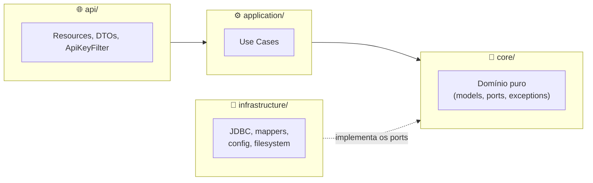
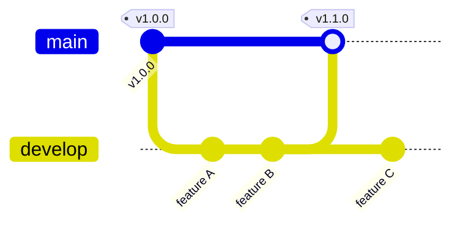
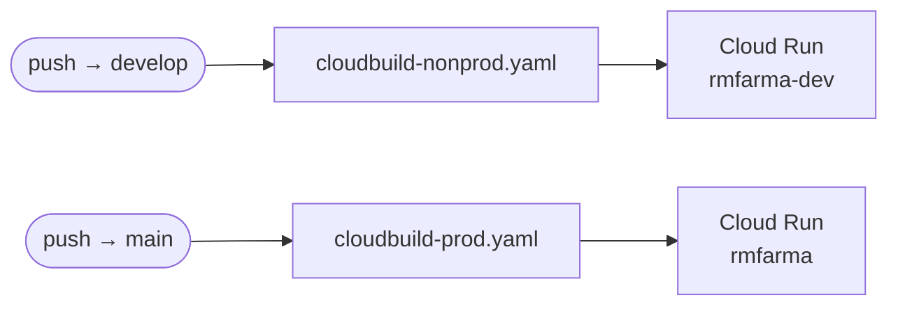

<div align="center">

# 💊 pharma-hub

**Repositório centralizado de consultas SQL analíticas do Grupo Hiper Saúde**

Queries pré-aprovadas de vendas, estoque e curva ABC, expostas via REST — com paginação, parâmetros tipados e autenticação por API Key.


</div>

---

## 📖 Sobre o projeto

Três endpoints principais:

| Método | Rota | O que faz |
|---|---|---|
| `GET` | `/queries` | Lista o catálogo de queries disponíveis |
| `GET` | `/queries/{key}` | Detalha os parâmetros de uma query |
| `POST` | `/queries/{key}/execute` | Executa a query e retorna o resultado |

Cada query é um par `metadata.yaml` + `query.sql` em `src/main/resources/queries/{query-key}/`. Adicionar uma query nova não exige lógica nova, só esses dois arquivos — detalhes em [`.planning/codebase/STRUCTURE.md`](.planning/codebase/STRUCTURE.md).

<details>
<summary><b>📋 Queries disponíveis</b> (11)</summary>
<br>

`sales-summary` · `sales-overview` · `sales-comparison` · `top-sellers` · `top-products` · `stock-search` · `stock-metrics` · `stock-without-sales` · `idle-stock` · `abc-curve-summary` · `abc-curve-products`

</details>

## 🧱 Stack

Java 21 · Quarkus 3.27.2 · JAX-RS + Jackson · PostgreSQL (JDBC/Agroal) · SmallRye OpenAPI/Swagger · GCP Secret Manager · Cloud Run (`southamerica-east1`) · GitHub Actions + Cloud Build

## 🏗️ Arquitetura

Hexagonal, 4 camadas, dependências sempre apontando para o domínio:



**Requisição típica:** `ApiKeyFilter` valida `X-API-Key` → o use case busca a `QueryDefinition` e valida parâmetros → `JdbcQueryExecutor` roda o SQL (parâmetros nomeados, sem risco de injection) → um `ResultSetMapper` converte o resultado.

📚 Detalhes completos em [`.planning/codebase/ARCHITECTURE.md`](.planning/codebase/ARCHITECTURE.md).

## ⚙️ Rodando localmente

```bash
# 1. Java 21 via SDKMAN (o projeto já tem .sdkmanrc, troca automática)
curl -s "https://get.sdkman.io" | bash && source "$HOME/.sdkman/bin/sdkman-init.sh"
sdk install java 21.0.5-tem

# 2. Autenticação GCP — os DOIS comandos são necessários, servem pra coisas diferentes
gcloud auth login                          # autentica a CLI
gcloud auth application-default login      # gera as ADC, que o Quarkus usa pra ler o Secret Manager
gcloud config set project rmfarma-dev

# 3. Rodar
./mvnw quarkus:dev
```

Sobe em **http://localhost:8080**. O perfil `dev` busca a URL/usuário/senha do banco direto do Secret Manager (secrets `gpt-db-host`, `gpt-db-user`, `gpt-db-password` em `rmfarma-dev`) — **não** usa `.env` nem `env.yaml`, esses arquivos na raiz não são lidos pela aplicação em nenhum perfil hoje.

> 🔑 API Keys de teste (hardcoded em dev): `dev-api-key-123` · `test-api-key-456`

<details>
<summary><b>🩹 Erros comuns</b></summary>
<br>

| Erro | Solução |
|---|---|
| `UNAUTHENTICATED: Failed computing credential metadata` | `gcloud auth application-default login` |
| `PERMISSION_DENIED` ao ler secret | Pedir `roles/secretmanager.secretAccessor` em `rmfarma-dev` ao time de infra |
| `Header X-API-Key é obrigatório` | Esperado — adicione `-H "X-API-Key: dev-api-key-123"` |
| `QueryNotFoundException` | `GET /queries` lista as keys válidas |

</details>

## 🧠 IntelliJ IDEA

- Abrir a raiz do repo — o IntelliJ detecta o `pom.xml` sozinho.
- `Project Structure > Project` → SDK Java 21 (aponte para `~/.sdkman/candidates/java/21.0.5-tem` se não detectar).
- Plugin **"Quarkus Tools"** (opcional) para live reload e navegação nos `application*.properties`.
- Run Configuration Maven com comando `quarkus:dev`.
- Sem Lombok/MapStruct — nenhum processador de anotação extra a configurar.
- Abra o IntelliJ a partir de um terminal já autenticado (`gcloud auth application-default login`) — ele herda as credenciais do shell.

## 🔐 Variáveis de ambiente e secrets

| Perfil | Origem do banco | API Keys |
|---|---|---|
| `dev` (local) | Secret Manager `rmfarma-dev`: `gpt-db-host`, `gpt-db-user`, `gpt-db-password` | Hardcoded: `dev-api-key-123`, `test-api-key-456` |
| `prod` (Cloud Run) | Secret Manager `rmfarma`: `pharmahub_db_url/user/password` *(⚠️ ver [CI/CD](#-cicd))* | `pharmahub_api_key_pharma_app`, `pharmahub_api_key_admin_dashboard` |

## 🧪 Testando a API

```bash
curl http://localhost:8080/health                                          # sem auth
curl -H "X-API-Key: dev-api-key-123" http://localhost:8080/queries         # catálogo
curl -X POST http://localhost:8080/queries/sales-summary/execute \
  -H "X-API-Key: dev-api-key-123" -H "Content-Type: application/json" \
  -d '{"params":{"cnpj":"12345678000100","startDate":"2024-01-01","endDate":"2024-02-01"}}'
```

Ou pelo **Swagger UI** (`/q/swagger-ui`) — clique "Authorize" e cole a API Key uma vez.

## 📦 Build

```bash
./mvnw package                                       # target/quarkus-app/quarkus-run.jar
./mvnw package -Dquarkus.package.jar.type=uber-jar   # über-jar (usado no Docker)
```

## 🌿 GitFlow

| Branch | Ambiente | Pipeline |
|---|---|---|
| `main` | Produção (`rmfarma`) | `cloudbuild-prod.yaml` |
| `develop` | Nonprod (`rmfarma-dev`) | `cloudbuild-nonprod.yaml` |



Branches de apoio saem de `develop` (`feature/*`, `release/*`) ou de `main` (`hotfix/*`) e voltam pra lá via PR. `main` só recebe merge de `release/*` ou `hotfix/*`, sempre com tag (`vX.Y.Z`).

O repo já tem a extensão [git-flow](https://github.com/nvie/gitflow) inicializada (`git flow init`). Fluxo recomendado — o PR no GitHub faz o merge de verdade, `git flow finish` só sincroniza local e limpa a branch:

```bash
git flow feature start nome-da-feature
# commits, push, PR no GitHub: feature/nome-da-feature -> develop
# depois do merge do PR:
git flow feature finish nome-da-feature

git flow release start 1.1.0     # a partir de develop
git flow hotfix start bug-x      # a partir de main
```

Sem a extensão instalada, o equivalente é `git checkout -b feature/nome-da-feature` a partir de `develop` — mesmo resultado.

Commits seguem [Conventional Commits](https://www.conventionalcommits.org/): `tipo(escopo): descrição` (`feat`, `fix`, `docs`, `refactor`, `chore`, `test`).

## 🚀 CI/CD



- **GitHub Actions** (`.github/workflows/ci.yml`): `./mvnw verify` em push/PR pra `main`. Só valida, não deploya.
- **Cloud Build**: builda a imagem e deploya no Cloud Run, um pipeline por ambiente (acima).

<details>
<summary><b>⚠️ Pendências antes do primeiro deploy automático</b> (auditado em 2026-08-06)</summary>
<br>

- Nenhuma trigger do Cloud Build está conectada ao repo `rm-farma/pharma-hub` — precisa criar as 2.
- `cloudbuild-nonprod.yaml` referencia secrets com underscore (`gpt_db_host`); os reais em `rmfarma-dev` usam hífen (`gpt-db-host`) — e não injeta nenhuma API Key.
- Os 5 secrets de prod (`pharmahub_db_url/user/password`, `pharmahub_api_key_*`) não existem ainda no projeto `rmfarma`.
- ✅ Permissões da service account do Cloud Build e o Artifact Registry `rm-farma` já estão OK nos dois projetos — não são bloqueio.

</details>

## 📁 Estrutura

```
src/main/java/com/rmfarma/pharmahub/
├── api/              # REST: resources, DTOs, filtros, exception mapper
├── application/      # Use cases
├── core/             # Domínio puro (sem deps externas)
└── infrastructure/   # JDBC, mappers, config

src/main/resources/
├── application*.properties   # Config base / dev / prod
└── queries/{key}/            # metadata.yaml + query.sql
```

📚 Guia de onde adicionar cada tipo de código em [`.planning/codebase/STRUCTURE.md`](.planning/codebase/STRUCTURE.md).

## ⚠️ Pontos de atenção conhecidos

Auditoria completa em [`.planning/codebase/CONCERNS.md`](.planning/codebase/CONCERNS.md):

- 🔴 **Zero testes** em `src/test/java/`.
- 🔴 Comparação de API Key vulnerável a timing attack (`ApiKeyFilter.java:60`).
- 🟠 Mensagens de erro vazam detalhes internos ao cliente.
- 🟡 `application-dev.properties`/`application-prod.properties` estão em Latin-1, não UTF-8.
- 🟡 `env.yaml` está no `.gitignore` mas aparece modificado no `git status` — indício de que já foi commitado com credenciais; vale investigar o histórico.

## 🔗 Links úteis

[Docs do Quarkus](https://quarkus.io/guides/) · [Datasources](https://quarkus.io/guides/datasource) · [Config YAML](https://quarkus.io/guides/config-yaml) · [SmallRye Health](https://quarkus.io/guides/smallrye-health)

## 🤖 Codando com Claude Code neste projeto

Este repositório já vem instrumentado para desenvolvimento assistido por IA. Antes de pedir pro Claude "entender o projeto do zero", olha se uma dessas ferramentas já não resolve mais rápido e mais barato:

| Ferramenta | O que é | Como usar |
|---|---|---|
| 🦀 **RTK** | Proxy que otimiza tokens de comandos de shell (`git`, `grep`, `ls`...) | Automático via hook — nada a configurar. `rtk gain` mostra a economia acumulada |
| 🧠 **claude-mem** | Memória persistente entre sessões — decisões e descobertas anteriores | Automático. Peça pro Claude buscar contexto antigo (skill `mem-search`) antes de retrabalhar algo |
| 🕸️ **graphify** | Grafo de conhecimento do código (nós/arestas de arquitetura) | `/gsd:graphify build` atualiza · `/gsd:graphify query <termo>` consulta · veja `.planning/graphs/graph.html` |
| 🗂️ **GSD** (*Get Shit Done*) | Framework de planejamento e execução por fases | `/gsd:map-codebase` (já rodado — ver abaixo), `/gsd:plan-phase`, `/gsd:execute-phase` — tudo em `.planning/` |
| 📓 **Obsidian vault** | Camada narrativa de domínio (decisões, conceitos de negócio farmacêutico) | 🚧 Planejado, ainda não implementado |

<details>
<summary><b>📚 Onboarding rápido</b> — o que já está mapeado, sem precisar reler o código inteiro</summary>
<br>

O `/gsd:map-codebase` já gerou uma análise completa do projeto em [`.planning/codebase/`](.planning/codebase/):

- [`ARCHITECTURE.md`](.planning/codebase/ARCHITECTURE.md) · [`STRUCTURE.md`](.planning/codebase/STRUCTURE.md) · [`STACK.md`](.planning/codebase/STACK.md) · [`INTEGRATIONS.md`](.planning/codebase/INTEGRATIONS.md)
- [`CONVENTIONS.md`](.planning/codebase/CONVENTIONS.md) · [`TESTING.md`](.planning/codebase/TESTING.md) · [`CONCERNS.md`](.planning/codebase/CONCERNS.md)

Peça pro Claude ler esses arquivos (ou rodar `/gsd:graphify query <termo>`) antes de sair explorando o código na unha — é mais rápido e mais barato em tokens. Re-rode `/gsd:map-codebase` depois de mudanças grandes de arquitetura para manter isso atualizado.

</details>

<div align="center">

---

Feito com 💊 pelo time **Grupo Hiper Saúde**

</div>
